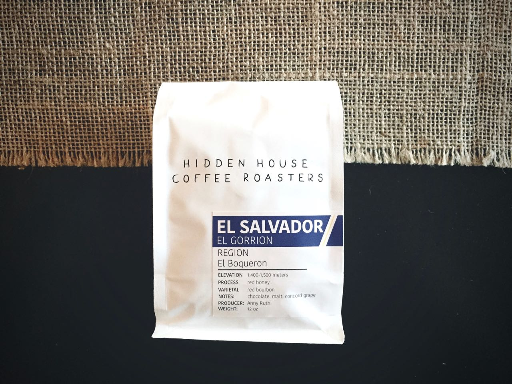

With Hidden House's El Salvador El Gorrion, there is no bright start. This coffee is dark and complex right away. There is a faint sweetness of dates or dried figs.

---

### General Information
**Origin:** El Salvador  
**Region:** N/A  
**Varietal:** Red bourbon  
**Elevation:** 1,400m - 1,500m    
**Process:** Red honey  
**Suggested Notes:** Chocolate, malt, concord grape      
**Date Roasted:** August 4th, 2016  
**Date Brewed:** August 15th, 2016  
**Brew Method:** Chemex  
**Price:** $18.00  
### Brewing
**Aroma:** Jasmine rice, red grape     
**Thoughts:** Very light in color, fragrant without being overpowering   
### Tasting
**Aroma:** Red grape, brown sugar  
**Notes I felt:** Date, dried fig, cream, vanilla, malt, chocolate  
**Description:** With Hidden House's El Salvador El Gorrion, there is no bright start. This coffee is dark and complex right away. There is a faint sweetness of dates or dried figs. The upfront sweetness is then embraced by a creamy vanilla middle. Even through the chemex it has a medium syrupy body. The finish is the most interesting. Lingering notes of chocolate, malt, and cream leave your palette evenly satisfied. Overall, a great example of how complex and fulfilling South American coffees can be. It manages to somehow go through the entire sip without letting any part of your palette drop or get missed.
### Conclusion 
**Expected:** 7.5/10   
**Rating:** 8.5/10  
