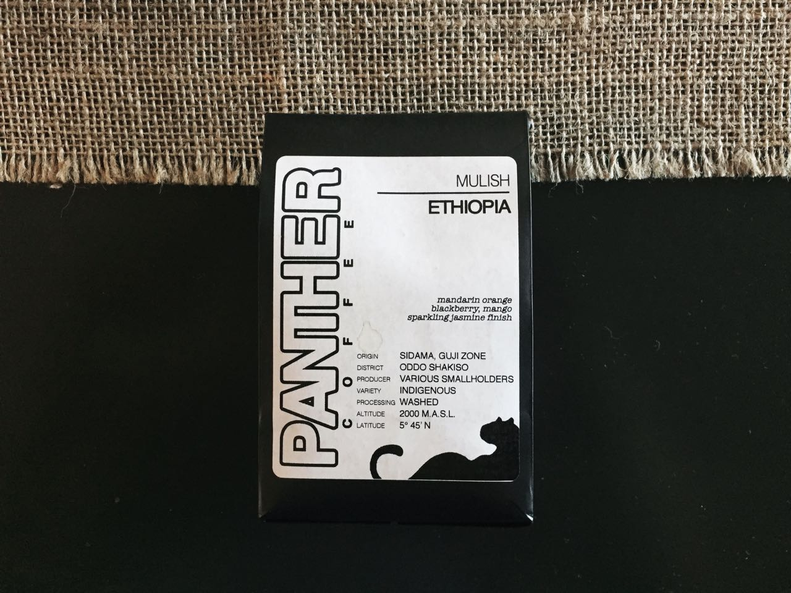

An unfortunately underwhelming Ethiopian coffee, the Mulish allows its less desirable notes dominate the softer floral and citrus notes. 

---

### General Information
**Origin:** Ethiopia  
**Region:** Sidama, Guji Zone   
**Varietal:** Ethiopian heirloom   
**Elevation:** 2,000m  
**Process:** Fully washed  
**Suggested Notes:** Mandarin orange, blackberry, with a jasmine floral finish     
**Date Roasted:**   
**Date Brewed:** July 6th, 2016   
**Brew Method:** v60   
**Price:** $15.95  
### Brewing
**Aroma:** Lime, cherry   
**Thoughts:** Starts off with a very quick bloom. After some trial and error I found that this coffee does better with a courser grind and will over expose very quickly.   
### Tasting
**Aroma:** Lime, jasmine honeysuckle, maple syrup,      
**Notes I felt:** Maple syrup, lime   
**Description:** The Panther Coffee Ethiopia Mulish starts off lime and a grassy note that is almost moldy in flavor. These give way to jasmine and subtle berry notes. These a leave a full finish of maple syrup and ash. Overall, I would describe it as a very sturdy coffee that has a tendency to let it's less desirable notes dominate the softer floral and citrus notes.
### Conclusion 
**Expected:** 7/10   
**Rating:** 6.5/10  

