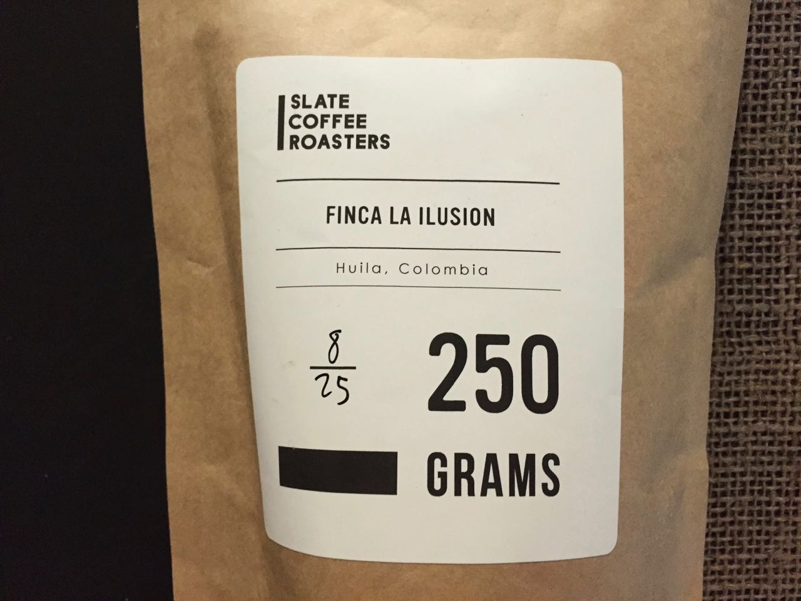

As illustrious as the title, Finca La Ilusion (*translation:*"Building the illusion"), this Colombian coffee changed my entire outlook on Colombian coffees. 

---

### General Information
**Origin:** Colombia  
**Region:** Huila  
**Varietal:** N/A  
**Elevation:** 1750m  
**Process:** Sun Dried Natural   
**Producer:** Rosevel Ortiz Escarpeta   
**Suggested Notes:** Blood orange, ripe banana, and a long, sweet finish reminiscent of rich caramel.  
**Date Roasted:** August 25th, 2016  
**Date Brewed:** September 4th, 2016  
**Brew Method:** v60  
**Price:** $12.50 - (250g)
### Brewing
**Aroma:** Extremely fragrant, lots of citrus    
**Thoughts:** Extremely fragrant, lots of citrus and even cocoa aroma. Very light and almost red in color.    
### Tasting
**Aroma:** Cocoa, olive, honeydew    
**Notes I felt:** Cocoa, orange   
**Description:** Slate Coffee Roasters Finca La Ilusion starts strong with immediate notes of juicy orange and deep green tea. The is light and silky, almost tea-like. The finish consists of lingering cocoa and caramel. Overall, an incredibly balanced, light, sweet cup that I will be sure to revisit.  
### Conclusion 
**Expected:** 7.5/10    
**Rating:** 9/10  
