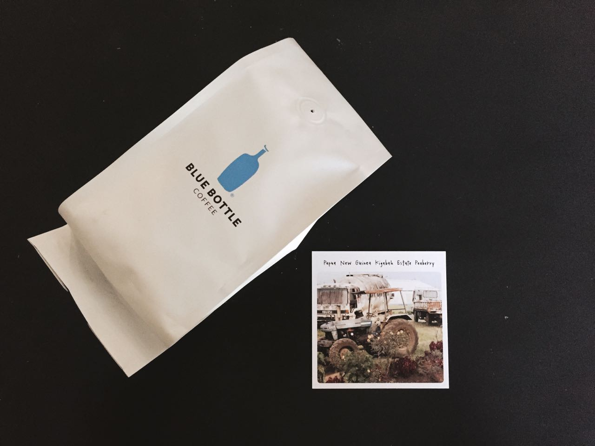

The Papa New Guinea Kigabah Estate Peaberry is a very mild and delicate coffee, almost reclusive in nature.

---

### General Information
**Origin:** Papua New Guinea  
**Region:** Wahgi Valley  
**Varietal:** N/A   
**Elevation:** N/A    
**Process:** N/A    
**Suggested Notes:** Delicate, tropical, structured      
**Date Roasted:** July 11th, 2016    
**Date Brewed:** July 17th, 2016    
**Brew Method:** Chemex   
**Price:** $18.75     
### Brewing
**Aroma:** Cherry, lime, mango      
### Tasting
**Aroma:** Cherry, apricot       
**Notes I felt:** Clementine, cherry, nectarine     
**Description:** The Papa New Guinea Kigabah Estate Peaberry is a very mild and delicate coffee, almost reclusive in nature. At first, I couldn't feel any of the notes very strongly. After drinking it a few times, its personality started to grow on me. Immediately, you are met with fairly deep notes of cherry. Even through the chemex, it has a medium smooth body. The finish consists of faint brown sugar and nectarine. Overall, a delicate coffee that becomes more complex and vibrant as you get to know it.   
### Conclusion 
**Expected:** 8.5/10     
**Rating:** 8/10    
