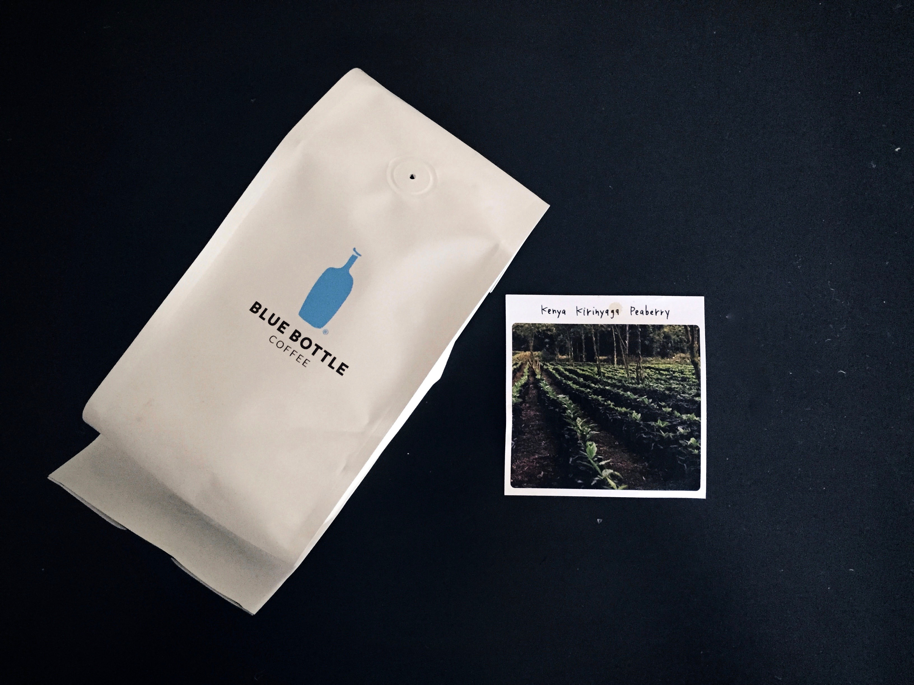

A very light coffee, the Kenya Kirinyaga bring out feelings of spring and new life with a light and tea-like body.

---

### General Information
**Origin:** Kenya  
**Region:** Kirinyaga  
**Varietal:** N/A  
**Elevation:** N/A   
**Process:** N/A  
**Suggested Notes:** Kiwi, sparkling, lemongrass     
**Date Roasted:** May 18th, 2016  
**Date Brewed:** May 22nd, 2016   
**Brew Method:** Chemex  
**Price:** $21.00  
### Brewing
**Aroma:** Green apple, mango, lemon   
**Thoughts:** Aroma-wise the beans are very fragrant and sweet smelling. As with all peaberries, they are a larger and harder bean. The coffee is very light in color with a caramel/creme soda coloration.    
### Tasting
**Aroma:** Lime, green apple, papaya, caramel    
**Notes I felt:** Mango, tangerine, sugar cane   
**Description:** A very light coffee, the Kenya Kirinyaga bring out feelings of spring and new life with a light and tea-like body. It has a nice balanced start that bring about notes of mango and tangerine. These flavors flow smoothly into a caramel and sugar cane center. Unfortunately, these are then overcome by a wild and unbalance aftertaste of bitter lime and lingering green apple. Even considering the unbalanced aftertaste, the Kirinyaga is a very satisfying cup that fits perfectly on a green spring day.
### Conclusion 
**Expected:** 9/10   
**Rating:** 8/10  