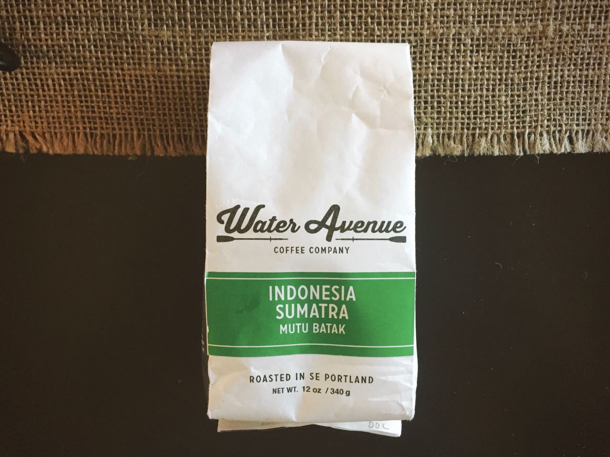

Possibly the best Sumatran coffee I have ever had, the Mutu Batak opens up strong with vibrant notes of cedar and magnolia.

---

### General Information
**Origin:** Sumatra  
**Region:** Lake Toba   
**Varietal:** Ateng, Djember, and Garundang   
**Elevation:** N/A  
**Process:** Wet-hulling  
**Suggested Notes:** Oak, red wine, and black currant     
**Date Roasted:** June 28th, 2016  
**Date Brewed:** July 21st, 2016  
**Brew Method:** Chemex   
**Price:** Gift - Thanks David!!  
### Brewing
**Aroma:** Cedar smoke, sage, black tea    
**Thoughts:** Massive fragrant bloom, almost rose colored in appearance.
### Tasting
**Aroma:** Fresh wood, date, lavender, magnolia, soil    
**Notes I felt:**  Cedar, hops, wine, dates  
**Description:** The Mutu Batak opens up strong with vibrant notes of cedar and magnolia. These almost seamlessly flow into a middle of hops and wine. The body even through a chemex is somewhere between creamy and full. The finish leaves balanced and deep notes of date and soil. The only thing negative that I can say is that this coffee tend to start to show bitterness as it cools. This coffee somehow manages to bring with it all of the things I love about Sumatran coffees while removing all of the ash and bitterness that is so characteristic of coffees from this region. Without a doubt the best Sumatran coffee I have had. It is certainly a potential candidate for my favorite coffee of all time. 
### Conclusion 
**Expected:** 7.5/10   
**Rating:** 9.5/10  