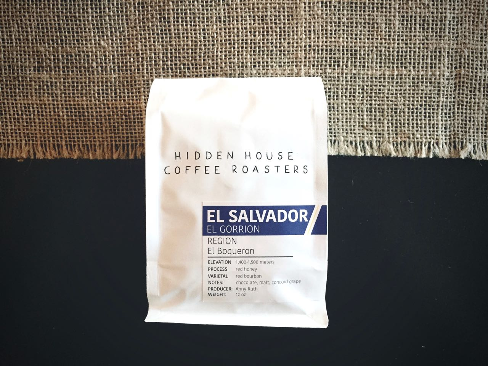

When I received the Terra Incognita from Portola via Misto Box, I do have to admit I was skeptical. I had stayed away from this coffee one because it is a blend and two because it is an “espresso”. After receiving and trying this coffee I have to admit that I was wrong.

---

# Portola Coffee Lab - Terra Incognita  Espresso Blend
### General Information
**Origin:** Ethiopia & Colombia   
**Region:** Harrar & Cauca    
**Varietal:** Various  
**Elevation:** 1700m - 2100m  
**Process:** Dry (Ethiopia) & Wet (Colombia)   
**Suggested Notes:** Floral, cane sugar; ripe red fruit, dark chocolate, caramel, and dried stone fruit     
**Date Roasted:**   
**Date Brewed:** August 25th, 2016    
**Brew Method:** v60  
**Price:** $15.95  
### Brewing
**Aroma:** Fresh bread, grape jelly   
**Thoughts:** Very aromatic, nice full bloom.    
### Tasting
**Aroma:** Stone fruit, dried cherries, brown sugar    
**Notes I felt:** Dried cherries, brown sugar, hibiscus, fresh bread 
**Description:** The Terra Incognita from Portola opens up with warm stone fruit. Specifically lots of vibrant dried cherry. The middle consists of balance warm bread and sugar cane. The body is heavy, almost velvety. The finish leaves lingering brown sugar and dark chocolate. In conclusion, the Terra Incognita is a bit too heavy and rich to be an "every day" coffee for me, but as an occasional change up it performs very well. It is well balance and keeps its flavor well as it cools.
### Conclusion 
**Expected:** 7/10   
**Rating:** 8/10  
